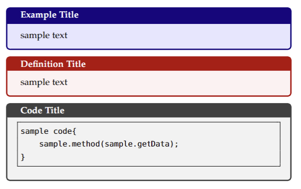

# textemplate-notes

To automatically compile LaTeX in Codespaces, install 
the following extensions:

[](https://marketplace.visualstudio.com/items?itemName=James-Yu.latex-workshop)

and run:

```sh
sudo apt update
sudo apt install texlive texlive-latex-extra latexmk
```

## Statement of Purpose

This repository contains the LaTeX template I use to take notes in school. 


I added three custom environments: one for examples

```LaTeX
\examplebox{Example}{\lipsum[1]}
```

one for definitions

```LaTeX
\definitionbox{Definition}{\lipsum[2]}
```

and one for code:

```LaTeX
\codeblockbox{Code Block}{python}{assets/code/example.py}
```

Here is the output of these three environments:


